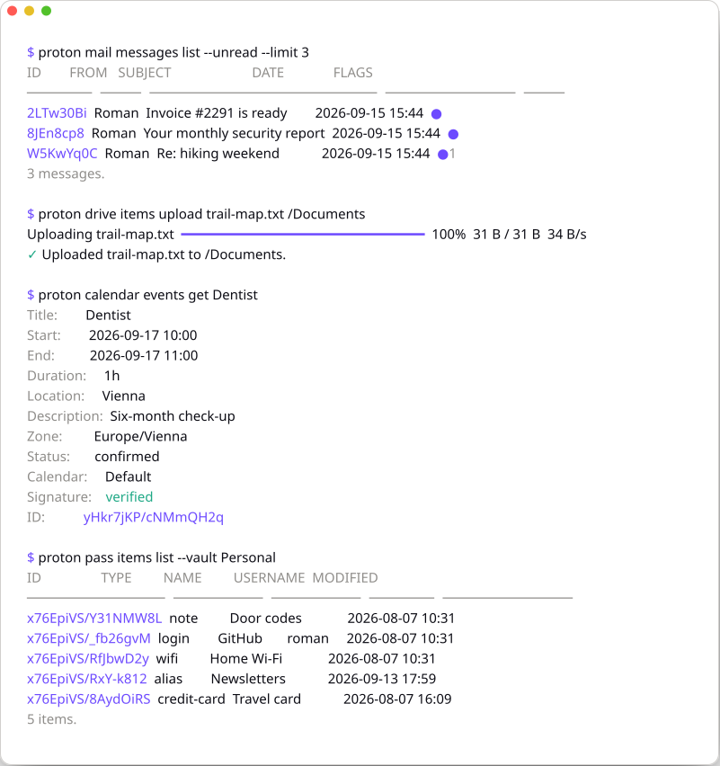

<div align="center">


# proton-cli

**Proton, in your terminal.**

_Unofficial, community-built, not affiliated with Proton AG._

[](https://github.com/roman-16/proton-cli/releases/latest) [](https://github.com/roman-16/proton-cli/releases) [](docs/installation.md) [](LICENSE)

**[proton-cli.lerchster.dev](https://proton-cli.lerchster.dev)** - the documentation, searchable.

<picture>
  <source media="(prefers-color-scheme: dark)" srcset="assets/demo-dark.svg">
  
</picture>

</div>
<br />

Read your mail, move files in and out of Drive, manage calendars, passwords, and contacts, all without opening a browser. proton logs in the way the Proton apps do and does the encryption on your machine, so your keys stay yours.

- **Real end-to-end encryption.** SRP login and the full PGP key hierarchy, handled locally with Proton's own [go-srp](https://github.com/ProtonMail/go-srp) and [gopenpgp](https://github.com/ProtonMail/gopenpgp). No bridge, no proxy, no browser in the middle.
- **Five apps, one binary.** Mail, Drive, Calendar, Pass, and Contacts, in a single static executable on Linux, macOS, and Windows.
- **Built for pipes and cron.** JSON and YAML with one envelope shape for every list, streaming stdin and stdout, exit codes that mean something, and `--dry-run` on everything that changes state, showing the rows it would touch.

## Install

```bash
curl -fsSL https://raw.githubusercontent.com/roman-16/proton-cli/main/scripts/install.sh | sh
```

```powershell
irm https://raw.githubusercontent.com/roman-16/proton-cli/main/scripts/install.ps1 | iex
```

Also on Homebrew, winget, APT, AUR, Nix, npm, and as plain signed binaries - see [Installation](docs/installation.md). The command is `proton`, and `proton-cli` works too.

## Sixty seconds

```console
$ proton account login
Email:            you@proton.me
Password:
Two-factor code:  123456

✓ Signed in as you@proton.me.
```

That's the whole setup - signing in saves the session **and** unlocks your keys, so your password is needed once on this machine and not again.

```bash
proton mail messages list --unread
proton mail messages get "Invoice #2291"
proton drive items upload ./report.pdf /Documents
proton calendar events list
proton pass items totp github.com
```

Every command reads the same way - `proton <app> <collection> <verb>` - and anywhere one wants an ID, a subject, name, path, or address works too. → [Getting started](docs/getting-started.md) · [The language](docs/language.md)

## What you can do

- **[Mail](docs/apps/mail.md)** - read, send, search and organize. Threads, attachments, filters, snoozing, block and allow lists, auto-reply.
- **[Drive](docs/apps/drive.md)** - files and folders as paths. Revisions, public links, sharing with people, trash, photo albums.
- **[Calendar](docs/apps/calendar.md)** - events and reminders. Recurrence occurrence by occurrence, attendees, invitations, .ics in and out.
- **[Pass](docs/apps/pass.md)** - logins and secrets. Notes, cards, SSH keys, identities, aliases, two-factor codes, item history.
- **[Contacts](docs/apps/contacts.md)** - your address book. Typed addresses and phones, the full vCard field set, duplicate merging.
- **[Account](docs/apps/account.md)** - profiles and settings. Sessions, per-app settings, more than one account side by side.

[`proton api`](docs/apps/api.md) reaches any endpoint the commands don't. The [command reference](docs/commands/README.md) has every command, argument and flag.

## Automate it

```bash
# creating something prints its new ID to stdout
ID=$(proton mail settings labels create --name Work --color purple)

# every list is an envelope keyed by its plural name, always with a count
proton mail messages list --unread --output json | jq -r '.messages[].subject'

# stream through, no temporary files
pg_dump mydb | gzip | proton drive items upload - /Backups/db.sql.gz

# check what a bulk change would touch before it happens
proton mail messages trash --from newsletter@example.com --older-than 90d --dry-run
```

Data goes to stdout and progress to stderr, so redirects stay clean. Exit codes tell user error, auth failure, not-found, ambiguity, and network trouble apart. Permanent removals, filter-selected changes, external communication, sharing, and network or security-sensitive changes ask first - and off a terminal they refuse instead, so an unattended run fails safe until you add `--yes`. → [Scripting](docs/scripting.md)

## Encryption you can verify

Your password never reaches Proton: login is SRP, and the key password it derives stays local and unlocks your PGP keys in memory. Mail, files, events, contacts, and Pass items are decrypted after they arrive and encrypted before they leave, with the same key hierarchy the web clients use.

The saved session keeps your key password encrypted with a key held server-side, so revoking the session from any Proton app makes a leaked copy of the file useless. proton-cli is unaudited; the storage model is written down in [Security](SECURITY.md) and the mechanics in [How it works](docs/how-it-works.md).

## Documentation

Everything is at **[proton-cli.lerchster.dev](https://proton-cli.lerchster.dev)** and in [`docs/`](docs/README.md) beside the code. [`CHANGELOG.md`](CHANGELOG.md) records what each version changed, and `proton changelog` prints it.

Already installed? `proton update`. An install no package manager owns says so itself, once a day.

## Contributing

Bug reports, ideas, and pull requests are all welcome. [`CONTRIBUTING.md`](CONTRIBUTING.md) covers the setup, and [`SECURITY.md`](SECURITY.md) has the private channel for security issues.

## Disclaimer

proton-cli is an independent, community-built project. It is not endorsed by, affiliated with, or supported by Proton AG. Proton is a trademark of Proton AG. Use it at your own risk, and mind Proton's terms of service.

## License

[MIT](LICENSE)
